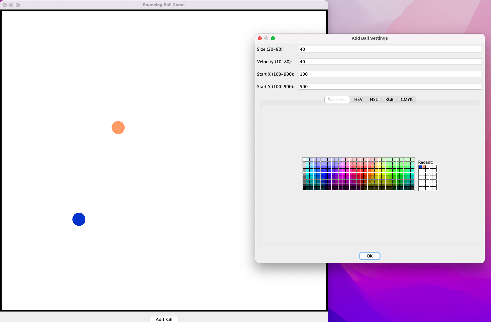

# The Bouncing Ball Game
This is a small game for the assignments of CSCI 2340.

## How to run
* Install all maven dependencies.
* Run `main()` in `Game.java`.

## Version History
* 11/2/2024: 

>- Complete window initialization.
>- Complete the bouncing effect.
>- Complete the sub-window for adding balls.

## Preview
